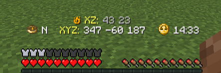

# Quick Info Panel mod for Minecraft

A simple client-only Fabric mod for Minecraft **1.20.6**, **1.21** that adds a little heads-up display with info about
**directions**, **coordinates** and **time of the day**.     
It also displays the corresponding coordinates in the Nether while you're in the Overworld, and vice versa while you're
in the Nether.

## Installation

Head up to the [Releases page](https://github.com/sbuicodev/mc-quick-info-panel/releases), download the latest
pre-release jar for your Minecraft version and install it in your favorite Fabric client.

## Usage

The mod features a very basic integration with ModMenu, where you can enable/disable the mod and change the panel's
position.   

It also comes with a few keybindings to quickly access a couple of features:
- Press `N` to toggle the alternate dimension's corresponding coordinates
- Press `B` to toggle the mod on or off

All keybindings can be configured in the game's own Key Binds settings page under the `Quick Info Panel` section.  

## Screenshots

